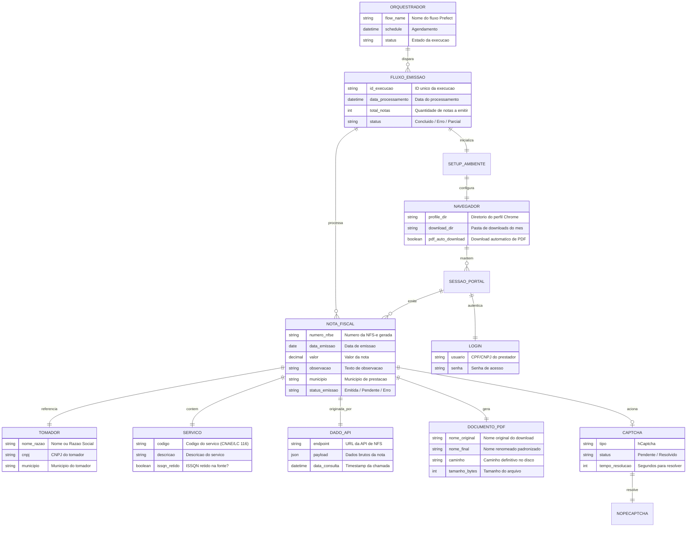
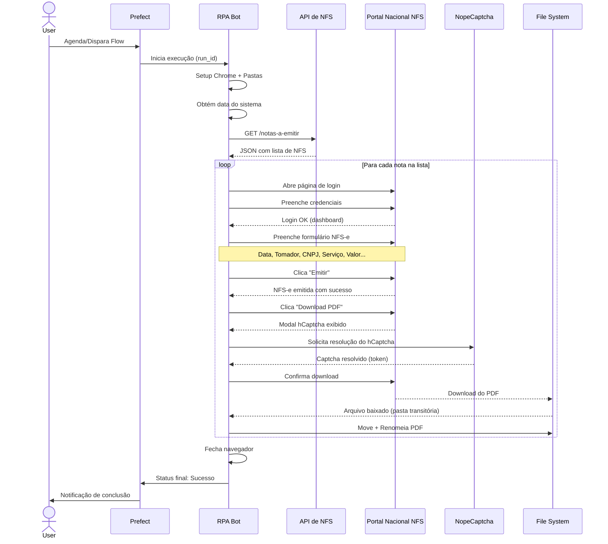

# RPA de Emissão de NFS-e

**Automação de Emissão de Nota Fiscal de Serviço Eletrônica via Portal Nacional**

---

## 1. Visão Geral do Projeto

Este RPA (Robotic Process Automation) automatiza integralmente o ciclo de emissão de NFS-e (Nota Fiscal de Serviço Eletrônica) no Portal Nacional, desde a obtenção dos dados via API até a organização do documento final em PDF. A solução elimina a necessidade de intervenção manual em processos repetitivos de faturamento, reduzindo erros e aumentando a produtividade operacional.

### Stack Tecnológica

| Camada          | Tecnologia                          |
|-----------------|-------------------------------------|
| Orquestração    | **Prefect**                         |
| Automação       | **BotCity** (BotCity Core + Selenium patches) |
| Navegador       | **Google Chrome** (Chromedriver)    |
| Linguagem       | **Python**                          |
| Captcha         | **NopeCaptcha** (resolvedor automático de hCaptcha) |
| Fonte de Dados  | **API REST** (consulta JSON)        |
| Arquivo Final   | **PDF** nomeado e organizado por mês |

---

## 2. MER - Modelo Entidade-Relacionamento

> Diagrama conceitual representando as entidades envolvidas no processo de emissão da NFS-e e seus relacionamentos.



---

## 3. Fluxograma do Processo

> Diagrama detalhado da sequência de execução do RPA, do início da orquestração até o arquivamento do documento.

```mermaid
flowchart TD
    A(["🚀 Início: Orquestrador Prefect"]) --> B["Registrar Log de Execução"]
    B --> C["Iniciar Instância do Navegador"]
    C --> D["Setup de Navegador e Pastas"]
    
    subgraph SETUP["⚙️ Setup Inicial"]
        D1["1. Finalizar instâncias anteriores do Chrome / Chromedriver"]
        D2["2. Criar diretório de downloads organizado por mês (MM-AAAA)"]
        D3["3. Configurar perfil Chrome: download automático de PDF"]
        D4["4. Aplicar patches BotCity + Selenium + maximizar janela"]
        D1 --> D2 --> D3 --> D4
    end
    
    D --> D1
    
    D4 --> E["Obter Data do Sistema"]
    E --> F["Formatar Data (dd/mm/aaaa)"]
    
    F --> G["Chamada API de NFS"]
    G --> H["Converter Resposta JSON em Lista de Notas"]
    
    H --> I{"Loop FOR EACH
    (Lista de NFS)"}
    
    I -->|Próxima Nota| J["Abrir Página do Portal Nacional de NFS"]
    
    subgraph LOGIN["🔐 Login no Portal"]
        J --> L1["Mapear Campo Usuário"]
        L1 --> L2["Mapear Campo Senha"]
        L2 --> L3["Mapear Botão Entrar"]
        L3 --> L4["Aguardar 3s"]
        L4 --> L5["Preencher Campo Usuário"]
        L5 --> L6["Preencher Campo Senha"]
        L6 --> L7["Clicar Botão Entrar"]
        L7 --> L8["Aguardar 3s"]
    end
    
    L8 --> M["Mapear Campos do Formulário NFS"]
    
    subgraph MAPEAMENTO["🗺️ Mapeamento de Elementos"]
        M1["Campo Data"]
        M2["Campo Tomador"]
        M3["Campo CNPJ Tomador"]
        M4["Botão Avançar 1"]
        M5["Campo Código de Serviço"]
        M6["Botão Serviço Prestado"]
    end
    
    M --> M1 --> M2 --> M3 --> M4 --> M5 --> M6
    
    subgraph PREENCHIMENTO["📝 Preenchimento dos Campos da Nota"]
        N1["Clicar Campo Data"]
        N2["Preencher Data + TAB"]
        N3["Scroll (10x)"]
        N4["Aguardar 2s"]
        N5["Clicar Botão Tomador"]
        N6["Aguardar 2s"]
        N7["Preencher CNPJ Tomador + TAB"]
        N8["Aguardar 2s"]
        N9["Clicar Botão Avançar 1"]
        N10["Aguardar 3s"]
        N11["Clicar Município e Preencher"]
        N12["Clicar Cód. Serviço, Preencher e Selecionar Rádio ISSQN"]
        N13["Scroll (1x)"]
        N14["Mapear Campo Observação"]
        N15["Preencher Observação"]
        N16["Mapear Botão Avançar 2"]
        N17["Clicar Avançar 2"]
        N18["Aguardar 3s"]
        N19["Mapear Campo Valor"]
        N20["Preencher Valor + TAB"]
        N21["Scroll (2x)"]
        N22["Mapear Botão Avançar 3"]
        N23["Clicar Avançar 3"]
        N24["Aguardar 1.8s"]
        N25["Scroll (5x)"]
        
        N1 --> N2 --> N3 --> N4 --> N5 --> N6 --> N7 --> N8 --> N9
        N9 --> N10 --> N11 --> N12 --> N13 --> N14 --> N15 --> N16
        N16 --> N17 --> N18 --> N19 --> N20 --> N21 --> N22 --> N23
        N23 --> N24 --> N25
    end
    
    M6 --> N1
    N25 --> O["Mapear e Clicar Botão Emitir"]
    O --> P["Aguardar 0.5s"]
    P --> Q["Scroll (1x)"]
    Q --> R["Mapear e Clicar Botão Download"]
    R --> S["Aguardar 2s (Modal Captcha)"]
    
    subgraph CAPTCHA["🤖 Resolução de hCaptcha"]
        S --> T["Entrar no iframe do hCaptcha"]
        T --> U["Variável Oculto = True"]
        U --> V{"While: Oculto == True?"}
        V -->|Sim| W["Dormir 1s"]
        W --> X["Mapear Sentinela no iframe"]
        X --> Y{"Sentinela Existe?"}
        Y -->|Não| V
        Y -->|Sim| Z["Variável Oculto = False"]
        Z --> AA["Dormir 2s"]
        Z --> AB["Sair do iframe hCaptcha"]
    end
    
    AB --> AC["Mapear Botão Confirma"]
    AC --> AD["Clicar Botão Confirma"]
    
    AD --> AE["Aguardar Download na Pasta Transitória"]
    AE --> AF["Mover e Renomear Arquivo PDF"]
    AF --> AG["PDF Arquivado com Sucesso"]
    
    AG --> I
    
    I -->|Fim da Lista| AH["Fechar Navegador"]
    AH --> AI(["✅ Processo Concluído"])
    
    I -->|Erro| AJ["Registrar Erro no Log"]
    AJ --> I

    style A fill:#4CAF50,color:#fff
    style AI fill:#4CAF50,color:#fff
    style AJ fill:#f44336,color:#fff
    style CAPTCHA fill:#FF9800,color:#fff
    style LOGIN fill:#2196F3,color:#fff
    style PREENCHIMENTO fill:#9C27B0,color:#fff
    style SETUP fill:#607D8B,color:#fff
    style MAPEAMENTO fill:#009688,color:#fff
```



---

## 4. Descrição Detalhada das Etapas

### 4.1 Orquestração (Prefect)

O fluxo é gerenciado pelo Prefect, que controla o agendamento, monitoramento de execução, tratamento de falhas e registro de logs. Cada execução gera um `run_id` único para rastreabilidade.

### 4.2 Setup do Ambiente

| Passo | Ação | Objetivo |
|-------|------|----------|
| 1 | Finalizar instâncias anteriores | Evitar conflitos de porta/processo com Chrome e Chromedriver residuais |
| 2 | Criar diretório `Downloads\MM-AAAA` | Organizar PDFs por mês de emissão |
| 3 | Configurar preferências Chrome | Forçar download automático de PDF sem diálogo "Salvar como" |
| 4 | Aplicar patches BotCity | Customizações do Selenium WebDriver + auto-maximização |

### 4.3 Obtenção da Data

Captura a data do sistema operacional e formata no padrão brasileiro `dd/mm/aaaa`. Esta data é utilizada como data de emissão nos formulários.

### 4.4 Consulta à API de NFS

- **Endpoint:** API REST que retorna a lista de notas a serem emitidas
- **Formato:** JSON
- **Conversão:** O payload JSON é desserializado para uma lista de objetos Python (dicionários)
- **Dados típicos por nota:** CNPJ do tomador, nome/razão social, código do serviço, valor, município, observação

### 4.5 Loop de Emissão (FOR EACH)

Cada nota da lista é processada individualmente no Portal Nacional:

#### 4.5.1 Autenticação no Portal

1. Navega até a URL do Portal Nacional de NFS-e
2. Mapeia os campos de login (usuário, senha, botão entrar)
3. Preenche as credenciais do prestador de serviço
4. Submete o formulário e aguarda o carregamento

#### 4.5.2 Preenchimento do Formulário NFS-e

| Etapa | Campo/Ação | Detalhe |
|-------|------------|---------|
| 1 | Data de Emissão | Clique + preenchimento + TAB |
| 2 | Scroll | 10x para baixo (alcançar campos inferiores) |
| 3 | Tomador | Abre modal/botão de busca do tomador |
| 4 | CNPJ Tomador | Preenchimento + TAB para auto-completar |
| 5 | Avançar 1 | Primeiro botão de avanço no wizard |
| 6 | Município | Seleção do município de prestação |
| 7 | Código de Serviço | Preenchimento + seleção rádio ISSQN |
| 8 | Observação | Texto livre da nota |
| 9 | Avançar 2 | Segundo botão de avanço |
| 10 | Valor | Preenchimento do valor + TAB |
| 11 | Avançar 3 | Terceiro botão de avanço (revisão) |
| 12 | Emitir | Botão de emissão definitiva |

#### 4.5.3 Download e Captcha

Após a emissão, o botão de download do PDF é acionado. O portal exibe um modal com **hCaptcha** para liberar o download.

**Estratégia de Resolução:**
- Entra no iframe do hCaptcha
- Define uma variável `oculto = True` como sentinela
- Loop `while oculto:` consulta periodicamente o estado do captcha
- **NopeCaptcha** resolve o desafio automaticamente (serviço externo de resolução)
- Quando o elemento sentinela (sucesso) aparece no iframe: `oculto = False`
- Sai do iframe, clica em "Confirmar" e aguarda o download

#### 4.5.4 Organização do Arquivo

1. Aguarda a conclusão do download na pasta transitória do Chrome
2. Move o arquivo para a pasta definitiva do mês (`Downloads\MM-AAAA`)
3. Renomeia o PDF conforme padrão pré-definido (ex: `NFSE_<numero>_<tomador>.pdf`)

### 4.6 Finalização

Ao terminar o loop, o navegador é fechado e o Prefect registra o status final da execução (sucesso, falha parcial ou erro total).

---

## 5. Arquitetura de Pastas

```
NFS_NEW/
├── bot.py                     # Script principal do robô
├── Bot.xaml                   # Workflow UiPath
├── Bot.docx                   # Documentação complementar (Word)
├── NFS_NEW.jproj              # Arquivo de projeto UiPath
├── prefect.yaml               # Configuração de orquestração Prefect
├── requirements.txt           # Dependências Python
├── requirements.bat           # Instalador de dependências
├── build.bat                  # Script de build (Windows Batch)
├── build.ps1                  # Script de build (PowerShell)
├── build.sh                   # Script de build (Bash)
├── .env                       # Variáveis de ambiente
├── .prefectignore             # Regras de ignore do Prefect
├── .vscode/
│   └── settings.json          # Configurações do VS Code
├── perfil/                    # Perfil do Chrome utilizado pelo Selenium
├── nfs/
│   └── teste_.pdf             # PDF de teste
├── download/
│   └── (PDFs baixados após emissão)
├── resources/                 # Recursos auxiliares
├── venv/                      # Ambiente virtual Python
├── __pycache__/               # Cache de bytecode Python
└── doc_projeto/
    ├── README.md              # Documentação geral (GitHub)
    ├── sequencia_atividades.md # Sequência passo a passo do robô
    └── documentation.md       # Documentação técnica completa
```

---

## 6. Tratamento de Erros e Resiliência

| Cenário | Estratégia |
|---------|------------|
| Chrome/Chromedriver residual | Kill de processos antes de iniciar nova instância |
| Timeout de carregamento | Waits explícitos com `WebDriverWait` + retry |
| Captcha não resolvido | Loop com timeout máximo; fallback para intervenção manual |
| Falha na API | Retry exponencial (3 tentativas) + log de erro |
| Download não concluído | Polling do arquivo `.crdownload` até desaparecer |
| Erro em uma nota | Log do erro e continuação para a próxima (fail-safe por nota) |

---

## 7. Diagrama de Sequência



---

## 8. Tecnologias e Justificativas

| Tecnologia | Justificativa |
|------------|---------------|
| **Prefect** | Orquestração robusta com agendamento, retry automático, UI de monitoramento e logs centralizados |
| **BotCity** | Framework Python para RPA com suporte nativo a Selenium, mapeamento de elementos e plugins |
| **Selenium WebDriver** | Automação de navegador madura e estável, com patches BotCity para contornar detecções anti-bot |
| **NopeCaptcha** | Serviço especializado em resolução de hCaptcha, essencial para o fluxo 100% desassistido |
| **Chrome + Chromedriver** | Navegador mais compatível com portais governamentais brasileiros |

---

## 9. Métricas de Performance

| Indicador | Valor Esperado |
|-----------|----------------|
| Tempo médio por nota | 45-90 segundos (depende do captcha) |
| Taxa de sucesso de emissão | ~95% |
| Tempo de resolução de captcha | 5-30 segundos (NopeCaptcha) |
| Notas processadas por hora | ~40-80 |

---

## 10. Roadmap de Evolução

- [ ] Integração com mais municípios que possuem portal próprio
- [ ] Envio automático do PDF por e-mail ao tomador
- [ ] Dashboard de acompanhamento em tempo real (Prefect UI)
- [ ] Suporte a certificado digital (A1/A3) para municípios que exigem assinatura
- [ ] Webhook de notificação em caso de falhas (Slack/Teams)

---

> **Documento elaborado para fins de portfólio. Projeto desenvolvido com Python, Prefect e BotCity.**
